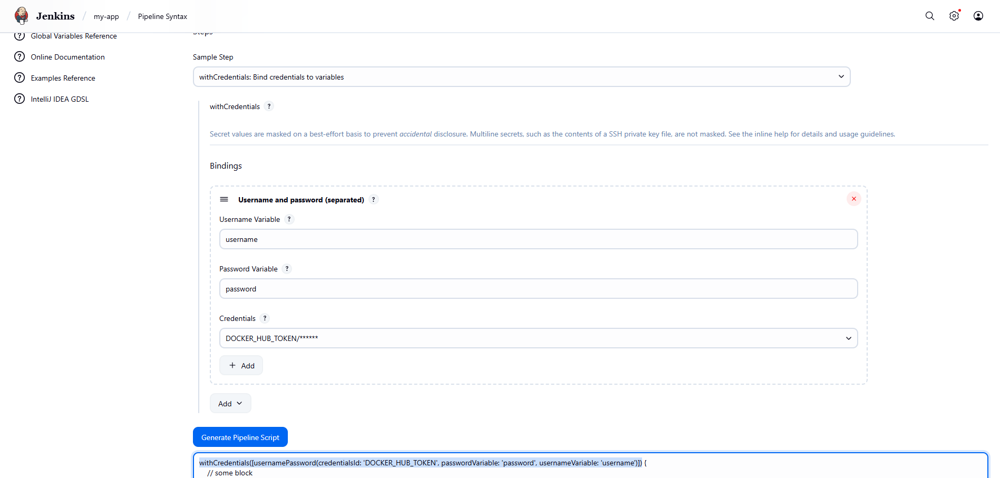

```jenkins
pipeline {
    agent any
    
    environment {
        DOCKER_USERNAME = 'furkankayam'
        IMAGE_NAME = 'jenkins-example-backend'
        IMAGE_TAG = '0.0.3'
        DOCKER_IMAGE = "${DOCKER_USERNAME}/${IMAGE_NAME}:${IMAGE_TAG}"
        GIT_REPO = "https://github.com/${DOCKER_USERNAME}/${IMAGE_NAME}"
    }
    
    stages {
        stage('Checkout') {
            steps {
                checkout scmGit(branches: [[name: '*/master']], extensions: [], userRemoteConfigs: [[url: "${GIT_REPO}"]])
            }
        }
        
        stage('Docker Images Build') {
            steps {
                sh "docker build -t ${DOCKER_IMAGE} ."
            }
        }
        
        stage('Docker Hub Push') {
            steps {
                script {
                    withCredentials([usernamePassword(credentialsId: 'DOCKER_HUB_TOKEN', passwordVariable: 'password', usernameVariable: 'username')]) {
                        sh "docker login -u ${DOCKER_USERNAME} -p \${password}"
                    }
                    sh "docker push ${DOCKER_IMAGE}"
                }
            }
        }
    }
}
```


